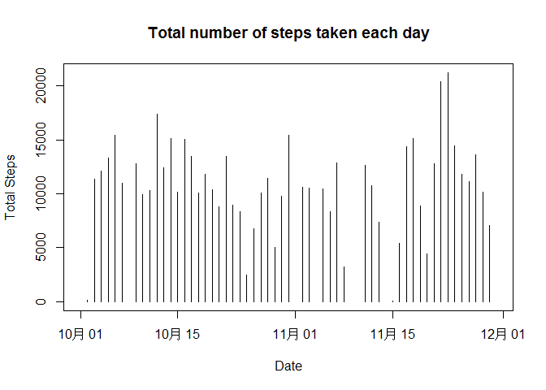
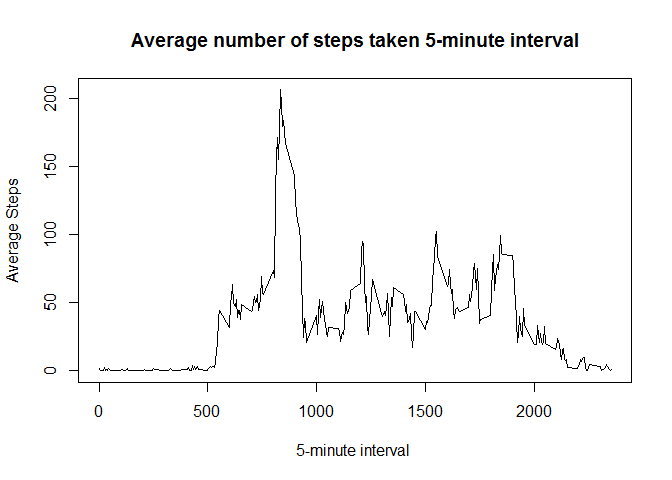
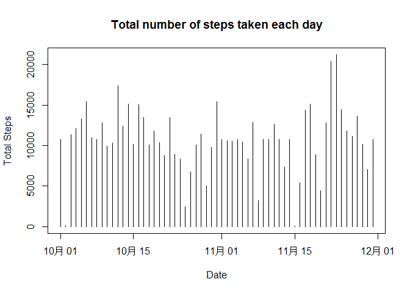
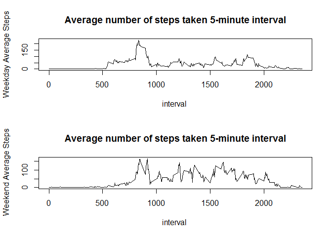

# Reproducible Research: Peer Assessment 1

## Set your work directory first

```r
library(dplyr)
```

```
## Warning: package 'dplyr' was built under R version 3.2.3
```

```
## 
## Attaching package: 'dplyr'
```

```
## The following objects are masked from 'package:stats':
## 
##     filter, lag
```

```
## The following objects are masked from 'package:base':
## 
##     intersect, setdiff, setequal, union
```

```r
library(ggplot2)
```

```
## Warning: package 'ggplot2' was built under R version 3.2.3
```

```r
#setwd("your folder/Reproducible Research/RepData_PeerAssessment1")
```


## Loading and preprocessing the data

```r
dat <- read.csv("activity.csv", header = TRUE,na.strings = "NA")
dat$date <- as.Date(dat$date, format="%Y-%m-%d")
```

## What is mean total number of steps taken per day?

```r
grouped <- group_by(dat, date)

total <- summarise(grouped, sum = sum(steps))

plot(total$date,total$sum,type = "h", main='Total number of steps taken each day', xlab = "Date", ylab="Total Steps")
```



```r
mean(total$sum,na.rm = T)
```

```
## [1] 10766.19
```

```r
median(total$sum,na.rm = T)
```

```
## [1] 10765
```


## What is the average daily activity pattern?

```r
grouped <- group_by(dat, interval)

average <- summarise(grouped, mean = mean(steps, na.rm = T))

plot(average$interval,average$mean,type = "l", main='Average number of steps taken 5-minute interval', xlab = "5-minute interval ", ylab="Average Steps")
```



```r
arrange(average,desc(mean))[1,1]
```

```
## Source: local data frame [1 x 1]
## 
##   interval
##      (int)
## 1      835
```


## Imputing missing values

```r
rowcount <- nrow(dat[!complete.cases(dat),])

newDat <- merge(dat, average, by = c("interval" ))

newDat <- mutate(newDat, steps = ifelse(is.na(steps), mean, steps), mean = NULL)

grouped <- group_by(newDat, date)

total <- summarise(grouped, sum = sum(steps))

plot(total$date,total$sum,type = "h", main='Total number of steps taken each day', xlab = "Date", ylab="Total Steps")
```



```r
mean(total$sum,na.rm = T)
```

```
## [1] 10766.19
```

```r
median(total$sum,na.rm = T)
```

```
## [1] 10766.19
```


## Are there differences in activity patterns between weekdays and weekends?

```r
newDat <- mutate(newDat, weekday = ifelse(as.POSIXlt(date)$wday %in% 1:5, "weekday","weekend"))
weekdayDat <- filter(newDat, weekday == "weekday")
weekendDat <- filter(newDat, weekday == "weekend")

groupedWeekday <- group_by(weekdayDat, interval)
groupedWeekend <- group_by(weekendDat, interval)

averageWeekday <- summarise(groupedWeekday, mean = mean(steps, na.rm = T))
averageWeekend <- summarise(groupedWeekend, mean = mean(steps, na.rm = T))

par(mfrow=c(2,1))
plot(averageWeekday$interval,averageWeekday$mean,type = "l", main='Average number of steps taken 5-minute interval', xlab = "interval ", ylab="Weekday Average Steps")

plot(averageWeekend$interval,averageWeekend$mean,type = "l", main='Average number of steps taken 5-minute interval', xlab = "interval ", ylab=" Weekend Average Steps")
```


